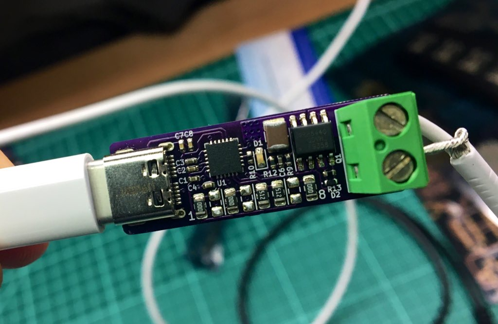

# USB-C-Power

Want to replace your non USB-C power/charge cables for USB-C ones? This project lets you do just that!

The board uses a [Cypress CYPD3177](https://www.cypress.com/file/460416/download) which will communicate with the USB power supply over USB-PD and negotiate the desired voltage and current. The voltage and current requested is set using 8 resistors that can be easily hand soldered to customize each one.

The available voltage ranges are: 5V, 9V, 12V, 15V, 19V, and 20V. You can set a minimum and maximum voltages in order to get the highest available or select just a single one so that you always know what you're getting.

The available currents range from : 0A to 5A in 0.25A increments.

If the selected voltage or current is not available, a red LED lights up and the output is disabled.

Trying to figure out which resistors to put where? Don't worry! I put together a nice calculator to do it for you. [Check it out here!](https://alvarop.com/usb_c_power/)

This board is designed to handle 5A @ 20V, but has only been tested to 3A @ 20V, so proceed with caution if you need the full 100W.

Want to build your own? Go to the [releases](https://github.com/alvarop/usb_c_power/releases) to get the files for latest stable version.
